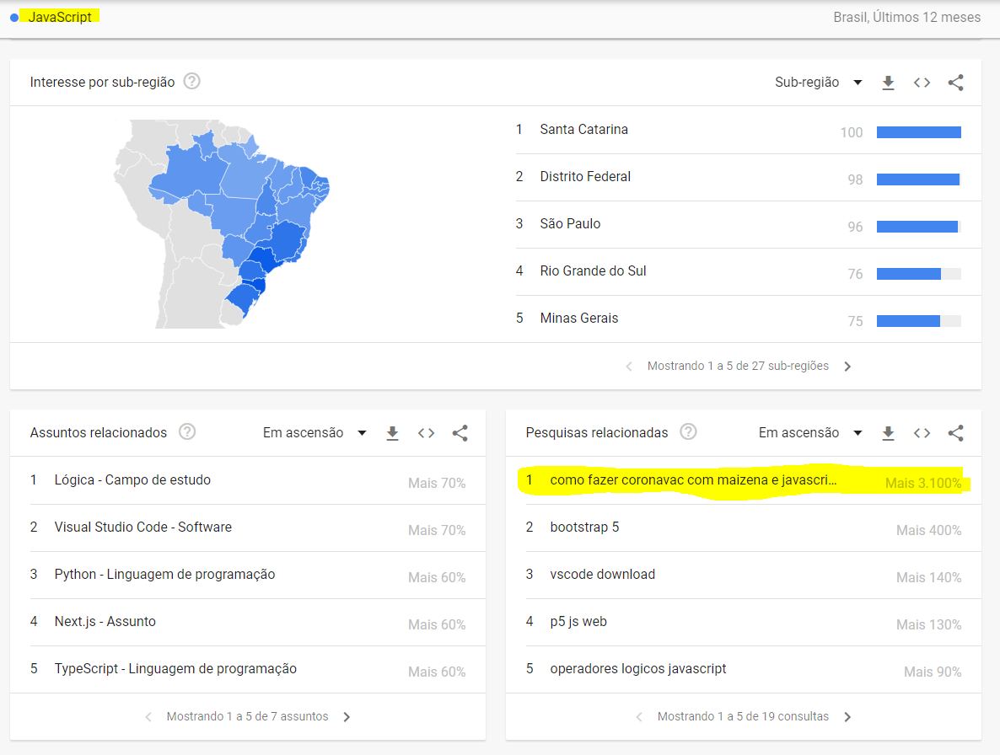

# JavaScript e Maizena cria Coronavac?

 Projeto baseado em uma pesquisa no Google Trends, por alguma razão na época da pesquisa, era um assunto que estava com uma grande ascenção. 

 E é o que acontece, quando um dev fica com um pouquinho de tempo livre aos sábados. 

 [Bora se conectar]
 https://www.linkedin.com/in/douglas-ahorstman/
 
 [Se inscreve lá pra ficar por dentro de mais conteúdos maneiros de JS]
 https://www.youtube.com/channel/UCP9C5I2j-MePwtwvIIaAsTQ

